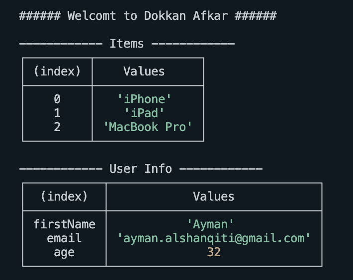

# دورة أساسيات لغة TypeScript

## التمرين الأول

نريد بناء نموذج لفاتورة عميل في أحد المتاجر الالكترونية، لنقوم بذلك نحتاج إلى مساعدتك، لذلك قم بإنشاء ملف بإمتداد `ts` وتعريف `7` متغيرات فيه وهي كالتالي `storyName`, `username`, `userEmail`, `itemName`, `itemQuantity`, `itemPrice` و `hasEmail` من أنواع البيانات التالية `string`, `number` و `boolean` ثم قم بتعيين قيم لها وطباعتها بالشكل التالي كما هو موضح في الصورة التالية

## التمرين الثاني

بعد شهر من ارتفاع المبيعات لدى صاحب المتجر بفضل جهودك في تطوير فواتيره الالكترونية قرر صاحب المتجر إجراء تعديل بسيط على شكل الفاتورة وذلك بتغيير بعض المتغيرات وأنواعها، قم بتعديل أنواع البيانات للمتغيرات السابقة لتصبح كالتالي:

- اسم المتجر `storeName` والذي يحتوي على قيمة نصية.
- أسماء العناصر المضافة من قبل العميل وهي عبارة عن `array` تحتوي على نصوص فقط يمثل كل عنصر فيها اسم من أسماء العناصر التي اختارها العميل
- بيانات العميل وهي عبارة عن `object` يحتوي على ثلاث عناصر الأول اسم العميل والثاني يحتوي على ايميل العميل والثالث يحتوي على عمر العميل

الآن قم بتعريف `function` باسم `invoice` ومرر لها هذه الثلاث قيم `storeName`, `items` و `userInfo` لتقوم بدورها بطباعة فاتورة العميل كما هو ظاهر في الصورة التالية

