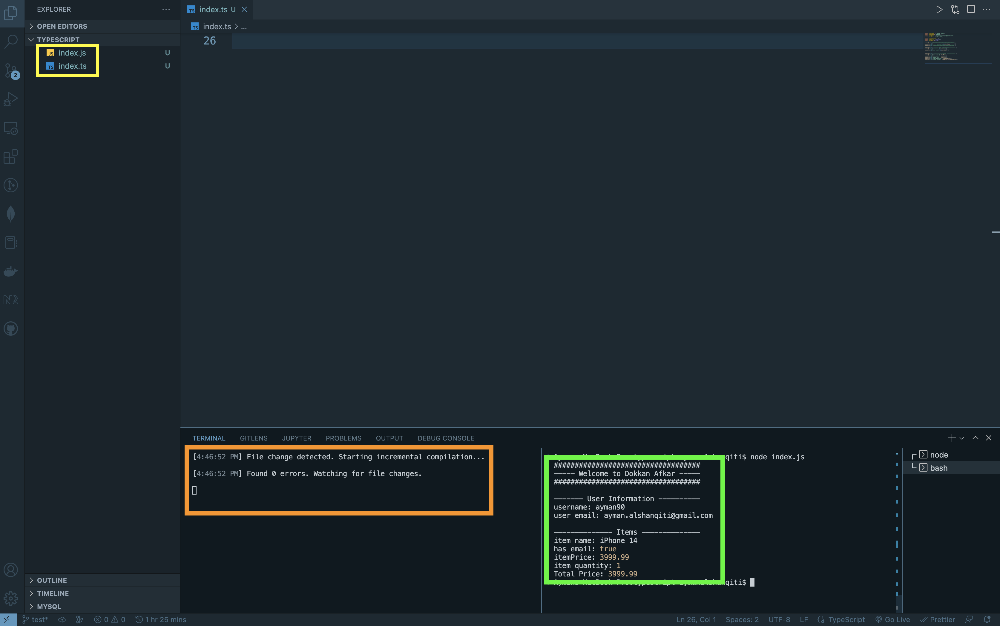

# دورة أساسيات لغة TypeScript

## التمرين الأول

نريد بناء نموذج لفاتورة عميل في أحد المتاجر الالكترونية، لنقوم بذلك نحتاج إلى مساعدتك، لذلك قم بإنشاء ملف بإمتداد `ts` وتعريف `7` متغيرات فيه وهي كالتالي `storyName`, `username`, `userEmail`, `itemName`, `itemQuantity`, `itemPrice` و `hasEmail` من أنواع البيانات التالية `string`, `number` و `boolean` ثم قم بتعيين قيم لها وطباعتها بالشكل التالي كما هو موضح في الصورة التالية

